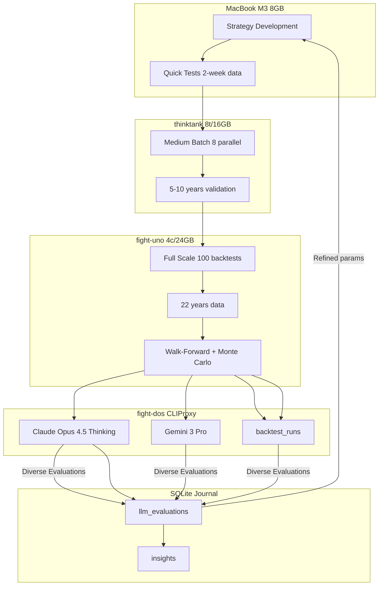

# Forex Backtester Architecture

## Overview

High-performance, distributed backtesting system for Forex strategy validation with LLM-assisted optimization.

## System Architecture



## Tech Stack

| Layer | Technology | Purpose |
|-------|------------|---------|
| Engine | HftBacktest (Rust + Python) | Tick-level backtesting |
| Data | Polars + Parquet | Memory-efficient data handling |
| Metrics | QuantStats + VectorBT | Performance analysis |
| **Costs** | **transaction_costs.py** | **Spread, commission, slippage modeling** |
| Parallelization | joblib | Distributed execution |
| Journal | SQLite | Result tracking & LLM memory |
| LLM | CLIProxy (Claude/GPT/Gemini) | Strategy evaluation |

## Data Sources

- **Primary**: Dukascopy (~22 years tick data)
- **Secondary**: HistData.com (M1 bars, extended history)
- **Format**: Parquet, partitioned by symbol/year

## Compute Resources

| Node | Specs | Role |
|------|-------|------|
| MacBook M3 | 8GB RAM | Development |
| thinktank.local | i5-8350U 8t, 16GB | Medium batch |
| fight-uno | 4c ARM, 24GB | Full scale |
| fight-dos | CLIProxy host | LLM evaluation |

## Directory Structure

```
forex-backtester/
├── docs/              # Documentation
├── data/              # Tick data (Parquet)
├── strategies/        # 20 base strategies
├── engine/            # Backtesting core
├── analysis/          # Metrics & validation
├── journal/           # Result tracking
├── llm/               # CLIProxy integration
└── config/            # Tuning parameters
```

## Validation Methodology

1. **Walk-Forward Analysis**: 6 rolling windows across 22 years
2. **Monte Carlo**: 1000 trade sequence permutations
3. **Regime Analysis**: Performance across market conditions

## References

- [Implementation Plan](file:///Users/faiqnau/.gemini/antigravity/brain/0847d21c-2aa5-4311-8d02-74ee32715964/implementation_plan.md)
